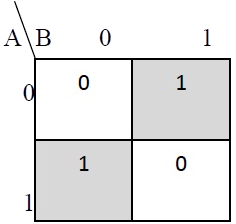
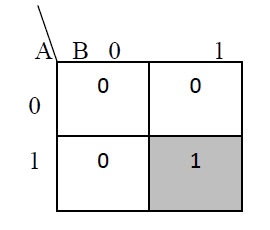
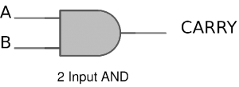
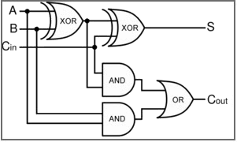
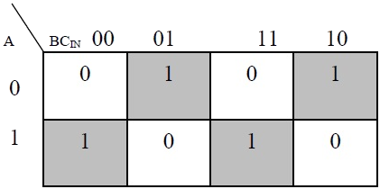

### Introduction
 
Adders are digital circuits that carry out addition of numbers. Adders are a key component of arithmetic logic unit. Adders can be constructed for most of the numerical representations like Binary Coded Decimal (BCD), Excess – 3, Gray code, Binary etc. out of these, binary addition is the most frequently performed task by most common adders. Apart from addition, adders are also used in certain digital applications like table index calculation, address decoding etc.
  
Binary addition is similar to that of decimal addition. Some basic binary additions are shown below. 

 <b>Figure 1. Schematic representation of half adder</b>
 
                 
### 1)Half Adder 
 
                    
Half adder is a combinational circuit that performs simple addition of two binary numbers. If we assume A and B as the two bits whose addition is to be performed,the block diagram and a truth table for half adder with A, B as inputs and Sum, Carry as outputs can be tabulated as follows.          

&nbsp;&nbsp;

                         

 <b>Figure 2. Block diagram and truth table of half adder</b>
                    
The sum output of the binary addition carried out above is similar to that of an Ex-OR operation while the carry output is similar to that of an AND operation. The same can be verified with help of Karnaugh Map.  
The truth table and K Map simplification and logic diagram for sum output is shown below. 

&nbsp;
&nbsp;
  

 
 <b>Figure 3. Truth table, K Map simplification and Logic diagram for sum output of half adder</b>
                       

<b>Sum = A B' + A' B</b>
 
             
The truth table and K Map simplification and logic diagram for carry is shown below. 
                        

&nbsp;
&nbsp;
 
 

 <b>Figure 4. Truth table, K Map simplification and Logic diagram for sum output of half adder</b>
                           
<b>Carry = AB</b> 

                        
If A and B are binary inputs to the half adder, then the logic function to calculate sum S is Ex – OR of A and B and logic function to calculate carry C is AND of A and B. Combining these two, the logical circuit to implement the combinational circuit of half adder is shown below. 
                        

    <b>Figure 5. Half Adder Logic Diagram</b>
 
                         
                      
As we know that NAND and NOR are called universal gates as any logic system can be implemented using these two, the half adder circuit can also be implemented using them. We know that a half adder circuit has one Ex – OR gate and one AND gate. 
                 
### 1.1)Half Adder using NAND gates </h2> 

Five NAND gates are required in order to design a half adder. The circuit to realize half adder using NAND gates is shown below. 

 <b>Figure 6. Realization of half adder using NAND gates</b>
 
                      
### 1.2)Half Adder using NOR gates 
 
                    
Five NOR gates are required in order to design a half adder. The circuit to realize half adder using NOR gates is shown below. 

 <b>Figure 7. Realization of half adder using NOR Gates</b>
 
                   

### 2)Full Adder 
 
                   
Full adder is a digital circuit used to calculate the sum of three binary bits. Full adders are complex and difficult to implement when compared to half adders. Two of the three bits are same as before which are A, the augend bit and B, the addend bit. The additional third bit is carry bit from the previous stage and is called 'Carry' – in generally represented by CIN. It calculates the sum of three bits along with the carry. The output carry is called Carry – out and is represented by Carry OUT. 
                       
The block diagram of a full adder with A, B and CIN as inputs and S, Carry OUT as outputs is shown below. 

&nbsp;&nbsp;
 
<b>Figure 8. Full Adder Block Diagram and Truth Table</b>
   

  
                         
<b>Figure 9. Full Adder Logic Diagram</b>
  
         
Based on the truth table, the Boolean functions for Sum (S) and Carry – out (COUT) can be derived using K – Map.
 

  

<b>Figure 10. The K-Map simplified equation for sum is S =  A'B'Cin + A'BCin' + ABCin</b>
  

 

<b>Figure 11. The K-Map simplified equation for COUT is COUT = AB + ACIN + BCIN</b> 
  
                     
In order to implement a combinational circuit for full adder, it is clear from the equations derived above, that we need four 3-input AND gates and one 4-input OR gates for Sum and three 2-input AND gates and one 3-input OR gate for Carry – out.
  
                     
### 2.1)Full Adder using NAND gates 
 
As mentioned earlier, a NAND gate is one of the universal gates and can be used to implement any logic design. The circuit of full adder using only NAND gates is shown below. 

 

<b>Figure 12. Full Adder using NAND gates</b>
 
                       
### 2.2)Full Adder using NOR gates
 
As mentioned earlier, a NOR gate is one of the universal gates and can be used to implement any logic design. The circuit of full adder using only NOR gates is shown below. 

  
<b>Figure 13. Full Adder using NOR gates</b>
  
                           

